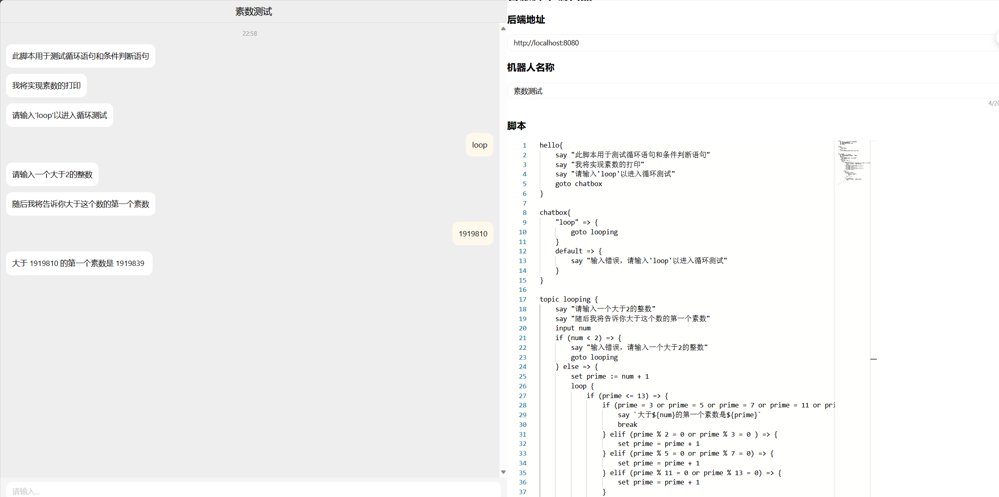

# Customer Service Bot Runtime Based On DSL

## 简介

本项目定义了一种可用来创建客服聊天机器人的领域特定语言（DSL），并提供了一个运行时，用于解析DSL并执行DSL中定义的逻辑。



## 用法
安装依赖
```shell
yarn install && cd client && yarn install
```

启动服务端
```shell
yarn start
```

启动客户端
```shell
cd client && yarn start
```

执行自动化测试
```shell
yarn test
```

手动输入，测试表达式
```shell
yarn test:calc
```

手动输入语法，展示语法树
```shell
yarn test:ast
```

运行本地命令行交互版本(采用docs/example.sc作为脚本文件执行)
```shell
yarn cli
```

在doc/api目录下生成程序内api文档
```shell
yarn doc
```

按照src/parser目录下的antlr4语法文件生成对应的可调用ts模板
```shell
yarn antlr4
```

## 语法说明
见[语法说明](docs/语法说明.md)

## 项目结构说明(详细实现原理请移步[完整说明](docs/详细说明.md))
```
.
├── README.md
├── client # 客户端,使用React实现
│   ├── src # 客户端源码
│   │   ├── App.tsx # 客户端入口
│   │   ├── components # 客户端组件,包含聊天部分和编辑器部分
│   │   │   ├── Chatbot.tsx # 聊天部分
│   │   │   ├── Editor.tsx # 编辑器部分
├── docs # 文档
│   ├── api # 程序内api文档
│   ├── case # 示例语法文件
│   ├── 语法说明.md # 语法说明
│   ├── 详细说明.md # 详细说明
│   ├── example.sc # 用于测试的脚本文件 
├── src # 服务端源码
│   ├── context # 运行时的上下文管理
│   ├── event # 事件管理
│   ├── executor # 执行器
│   ├── expr # 表达式相关
│   ├── parser # 语法解析部分
│   ├── runtime # 运行时的相关实现
│   ├── session # 会话管理
│   ├── stmt # 语句结构管理
│   ├── visitor # 用于遍历语法树
│   ├── index.tsx # 服务端入口
│   ├── exec.ts # 本地执行CLI入口
├── test # 测试用例