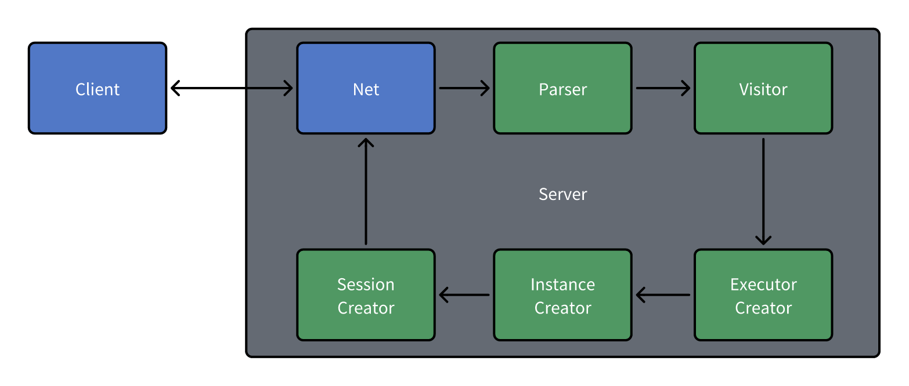
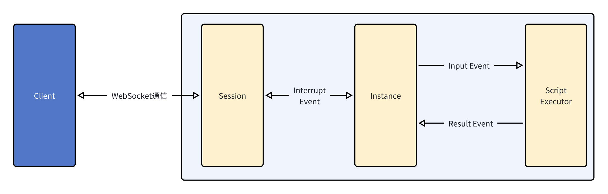

# Customer Service Bot Runtime Based On DSL

## 整体架构解析

### 从脚本到运行时的创建

脚本从客户端发送，到服务端生成运行时的过程如下图所示

上述流程的具体解析如下:

1. 客户端利用HTTP请求，将脚本发送给服务端
2. 服务端接收到脚本后，利用Parser模块生成对应的语法树
3. 服务端利用Visitor模块遍历语法树，将语法树解析为内部的数据结构(即stmt目录下的类)
4. 服务端利用上一阶段解析出的stmt集合，创建生成Executor集合
5. 服务端利用上一阶段生成的Executor集合，构造生成一个可运行的实例
6. 最后，服务端用一个Websocket会话包装这个实例，并通过Net模块将websocket链接回传给客户端

在执行完上述流程后，客户端就可以利用websocket与服务端进行通信，从而实现与运行时的交互。
对于CLI版本，上述的Net模块直接被一个本地的命令行交互模块替代，从而实现了本地的命令行交互版本。

### 脚本的执行过程
整个运行时采用事件驱动的方式运行，具体运行方式如下所示

上述流程的具体解析如下:
- Client和Server的Session直接通过Websocket进行通信, 利用Websocket的交互事件进行驱动
- Session和Instance利用中断事件(Interrupt Event)进行通信
- Instance利用Input Event和Result Event同Executor进行通信
通过这种事件驱动的方式，实现了客服机器人同客户的交互。

## 各层级详细介绍(包含各模块暴露的API,详细API见)

### Parser模块和Visitor模块
Parser模块负责将脚本解析为语法树，Visitor模块负责遍历语法树，将语法树解析为内部的数据结构(即stmt目录下的类)。这俩阶段被封装在类`PaserStage`的函数`handle_script`中，具体实现如下:
```typescript
/**
   * Handles the parsing of a script.
   * @param script The script to be parsed.
   * @returns The parsed script statement or null if parsing fails.
   */
handle_script(script: string): ScriptStmt | null {
    // 先进行词法分析
    let lexer = new cslLexer(CharStreams.fromString(script));
    let tokens = new CommonTokenStream(lexer);
    // 语法分析
    let parser = new cslParser(tokens);
    let visitor = new ScriptVisitor();
    let stmt = visitor.visit(parser.script());
    return stmt;
}
```
Parser部分主要通过`antlr4ng`库提供的相关工具实现。利用此库的CLI工具，在`src/parser`目录下生成对应的词法分析器和语法分析器，然后在`parser`目录下生成对应的Visitor模块，以供后续使用。

Vistor模块目录位于`src/visitor`下，主要用于遍历语法树，将语法树解析为内部的数据结构(具体为`stmt`和`expr`目录下的类)。每一个`stmt`代表一个语法结构，其通过
成员函数，将该语法结构有效的信息暴露出来，给Executor生成使用。

### Executor模块

Executor为运行时的重要组成部分。Instance通过对Executor的操作，来不断地处理
客户传来的输入信息。以下将分为创建和运行两部分来介绍Executor模块

#### 创建Executor
每个语句都会对应着一个Executor，Executor的构造函数一般会接受对应的stmt作为参数。经历完上一阶段后，Visitor模块会返回顶层脚本描述类`ScriptStmt`，随后在`SessionStage`类中的`handle_event`函数中调用`ScriptExecutor`类的构造函数，
从而实现主执行器的创建。

#### 使用Executor
每一个Executor会暴露三个接口，分别为`open`,`next`和`close`,它们的用途分别如下:
- `open`: 告诉Executor准备开始执行，Executor将初始化自己的状态和运行环境，开辟一块新的作用域（如果需要的话）,随后返回
- `next`: Executor执行的主逻辑。在上文的图中，Instance传来的Input Event会在这里被处理，每次处理结束之后都会返回Result Event，告诉Instance本轮Executor的执行结果，让Instance决定下一步的操作。
- `close`: 告诉Executor准备结束执行，Executor将清理自己的状态和运行环境，随后返回
一个Executor的生命周期从`open`到`close`，在这个过程中，Executor会不断地调用`next`函数，直到`next`函数返回一个Result Event，才会停止调用`next`函数，随后调用`close`函数，结束Executor的生命周期。

### Instance模块
Instance模块主要用于维护一个客服机器人对象。一个Instance只会拥有一个Executor，模块位置在`src/runtime/instance.ts`中
Instance主要暴露了如下几个接口:
- `start`: 启动Instance，Instance会调用主执行器的`open`函数，将Instance的状态置为`running`
- `run`: 开始运行Instance。Instance会进入一个事件循环，它会不断地调用Executor的`next`函数，直到Executor返回的Result Event提示其需要做对应中断操作，才会按需调用参数中传入的中断回调函数，向上层Session发送通知（一般为输入输出函数）,回调函数返回后继续执行事件循环。在执行完毕后，会先利用中断回调函数向Session发出退出的通知，随后退出事件循环。
- `push_input`: 为了实现异步的输入和语法中超时跳过输入的操作，Instance向Session暴露了一个`push_input`函数，用于将输入信息推入到Instance的输入队列中，等待Instance的事件循环处理。

### Session模块
在C/S版本中, Session模块维护了一个WebSocket连接，并且实现了一个传给Instance的
中断回调函数`on_interrupt_event`，用于处理Instance的中断事件。在CLI版本中，Session模块被一个本地的命令行交互模块替代，从而实现了本地的命令行交互版本。


### Context模块
这个模块主要用于维护运行时的上下文环境，它会在Instance的`start`函数中被创建，随后传给Instance的Executor。Context模块主要暴露了如下几个接口:
- `enter_new_scope`: 进入一个新的作用域，Context会将当前的作用域压入作用域栈中，随后创建一个新的作用域，作为当前的作用域
- `exit_current_scope`: 退出当前的作用域，Context会将当前的作用域弹出作用域栈，随后将作用域栈的栈顶作为当前的作用域
- `set_local_symbol`: 设置一个局部变量，如果当前作用域中已经存在同名的变量，则会覆盖原有的变量
- `set_global_symbol`: 设置一个全局变量，如果当前作用域中已经存在同名的变量，则会覆盖原有的变量
- `assign_local_symbol`: 给一个非全局变量赋值，如果在作用域栈中找不到对应的变量，则会抛出异常
- `assign_global_symbol`: 给一个全局变量赋值，如果在全局符号表中找不到对应的变量，则会抛出异常
- `get_symbol`: 获取一个变量的值，如果在所有作用域(包括全局符号表)中找不到对应的变量，则会返回undefined
- `is_in_scope`: 判断一个变量是否在局部作用域中，测试用

这个模块会在每一个Executor的open函数中被接收，由Executor根据自身情况维护Context的状态。

### Expression表达式模块
为了灵活支持各种表达式，在本脚本语言中的一切可计算单元均被视为表达式。故在本脚本语言中，表达式可以分为下面几种类型:
- 算术表达式(对应`ArithmeticExpr`)
- 比较表达式(对应`ComparisonExpr`)
- 逻辑表达式(对应`ConjunctionExpr`)
- 后缀表达式(对应`PostfixExpr`)
- 一元表达式(对应`UnaryExpression`)
- 常量表达式(对应`ValueExpr`)
- 数组表达式(对应`ArrayExpr`)
- JSON表达式(对应`JsonExpr`)
- 变量表达式(对应`FieldExpr`)
- 模板字符串表达式(对应`TemplateStringExpr`)

表达式在Vistor访问AST时一并被创建。其对外暴露接口如下
- `get_value` 获取表达式的值，需要当前的上下文
- `try_get_value` 在不用上下文的情况下尝试求值，用于常量解析和表达式优化
- `get_type` 获取表达式的类型
- `get_value_type` 获取计算后得到的值类型
对于模板字符串，还额外暴露了如下接口
- `get_raw_value` 在正常的`get_value`函数中,模版字符串的变量和常量部分之间会加入空格，此函数会返回直接拼接的结果。

## 测试部分
### 测试桩
为了测试各个模块的正确性，本项目提供了几个相关测试桩
- Executor测试桩 `ExecutorMock`,位于`src\executor\executor.ts`
- Stmt测试桩 `StmtMock`,位于`src\stmt\stmt.ts`
- CommandStmt测试桩 `CommandStmtMock`,位于`src\stmt\command_stmt.ts`
- Context测试桩 `ContextMock`,位于`src\context\context.ts`

### 自动测试部分
自动测试相关代码在`test`目录下，对应模块的测试文件也对应`src`目录，存在相同的路径下。
自动测试采用ava测试框架编写，仅需在项目根目录下运行`yarn test`即可运行所有测试用例。

### 手动测试部分
在`docs/case`中提供了一些示例脚本，可以提供给用户手动测试;
若想测试表达式计算,可在根目录下执行`yarn test:calc`,即可调出CLI交互界面,实时计算表达式结果
若想查看语法树生成是否正确，可在根目录下执行`yarn test:ast`,即可按提示输入脚本，查看生成的语法树。